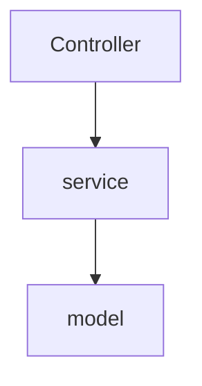
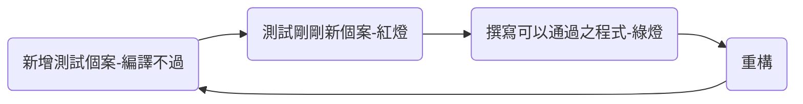
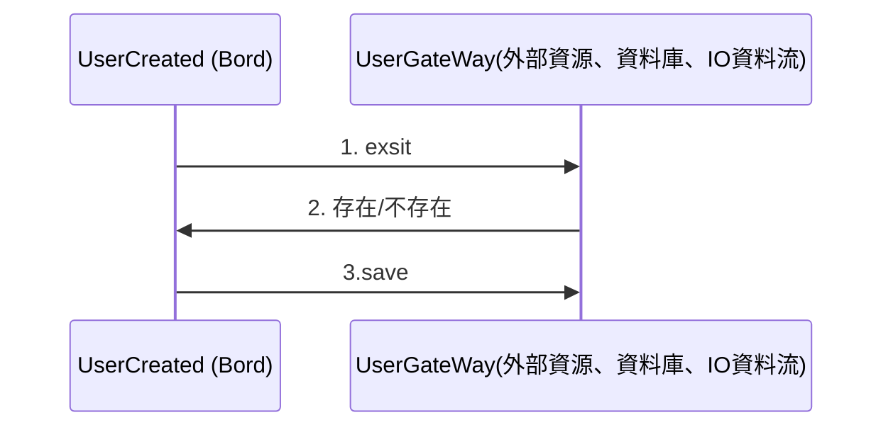

### 測試重要性

越早進行測試，未來負擔越小!測試是永遠避不了的，透過單元測試可完成持續性遞迴測試，保證業務邏輯正確，測試推到後面去辛苦遽增，測試範圍大增
ex:
單元測試：可以很明確簡單完成測試(僅測關鍵業務邏輯)
整合測試：基本上很困難透過測試(需依賴外部來源)


測試永遠少不了，測試越早執行負擔越小，工程師常常想反正我寫完還是要測試，那時候在手動測試即可，

### 前言

TDD屬於單元測試測試類型(僅測試該程式功能)，當測試service時，
不須考慮model(資料/外部)，僅測試service，常常使用假的替代(策略模型)，不依賴外部資源，表示在任何環境下都可以執行!




在一般專案中常常發現，幾乎沒發現有撰寫程式碼一般原因如下：

1. 寫不出來(沒人教過)
2. 有人教過，但是寫錯方式
3. 前輩說寫測是很花時間沒有效益。
4. 寫測試花費時間太多，可成會多花一倍時間?

### AAA概念

- Arrange: 先設定我們在這次測試中，所預期的結果(個案)
- Act: 就是我們想要測試的 function 或 method
- Assert: 確認在 Action 發生後，確認在執行了想要測試 function 或 method 後，的確符合我們在 Arrange 階段設定的目標

 A [] B  >C

### 步驟

### 撰寫測試目的與優點

1. 從測試出發，才比較容易寫出可以測試之程式
2. 容易真正關鍵核心業務
3. 不依賴外部系統、來源或資料庫。
4. 才能滿足CI/CD需求(每次打包之程式都有經過驗證確認)

### 使用TDD撰寫測試程式

1. 重測試開始寫，因對應物件尚未建立所以無法編譯
2. 完成程式可編譯即可
3. 撰寫通過個案程式
4. 重構原有程式
5. 每次修改都重新執行確認保持綠燈(程式有驗證)



##### 經典案例 Tennis Kata

一個完整的網球比賽分成：

網球每局的記分方法：「零」（love）、「十五」（fifteen）、「三十」（thirty）和「四十」（forty）。記分時，發球手的得分在前。因此「30比0」的意思是，發球手贏得2分，而接球手還未得分。

| PLAYER1 | PLAYER2 | source       |
| ------- | ------- | ------------ |
| 0       | 0       | love:love    |
| 0       | 15      | love:fifteen |
| 0       | 40      | love:forty   |


簡單重構


# 更貼近進階案例

### 規則

建立使用者帳號：
1.帳號不存在 2.帳號長度6碼 3.密碼包含英文更數字



### 個案

1.建立帳號成功案例(CreateUser)

- 帳號:A1234567
- 密碼：7654321A
- `<font color="#660000">`不存在 `</font><br />`


```java

package tdd;

public class UserCreated {
	public CreateUserReponse createUser(CreateUserRequest createUserReques) {
		// TODO Auto-generated method stub
		return null;
	}
}

```


```java
public class UserCreated {

	private UserGateWay userGateWay;

	public UserService(UserGateWay userGateWay) {
		super();
		this.userGateWay = userGateWay;
	}

	public CreateUserReponse createUser(CreateUserRequest createUserReques) {
		String account = createUserReques.getAccount();
		String passowd = createUserReques.getPassowd();
		boolean exsit = this.userGateWay.exsit(account);

		CreateUserReponse createUserReponse = new CreateUserReponse();
		if (!exsit) {
			boolean isMore6 = account.length() > 6;
			boolean isPasswordOk = this.checkPasswor(passowd);
			if (isMore6 && isPasswordOk) {
				User user = new User(account, passowd);
				createUserReponse.setUser(user);
				userGateWay.save(user);
			}
		}
		return createUserReponse;

	}

	private boolean checkPasswor(String passowd) {
		boolean isDigit = false;
		boolean isLetter = false;
		for (int i = 0; i < passowd.length(); i++) {
			if (Character.isDigit(passowd.charAt(i))) {
				isDigit = true;
			}
			if (Character.isLetter(passowd.charAt(i))) {
				isLetter = true;
			}
		}
		return isDigit && isLetter;
	}

}
```

```java

public class UserCreated {

	private static final String A1234567 = "A1234567";

	/**
	 * 建立帳號成功案例 - 帳號:A1234567 - 密碼：7654321A - 不存在
	 */
	@Test
	public void create_sucesfully() {

		UserGateWay userGateWay = Mockito.mock(UserGateWay.class);

		Mockito.when(userGateWay.exsit(A1234567)).thenReturn(false);

		UserService userService = new UserService(userGateWay);

		CreateUserRequest createUserReques = new CreateUserRequest(A1234567, "7654321A");

		CreateUserReponse reponse = userService.createUser(CreateUserReques);

		assertTrue(reponse.getUser() != null);

	}
}

```

2.建立帳號失敗案例

- 帳號:A1234567
- 密碼：7654321A
- `<font color="#660000">`存在 `</font><br />`

```java

	/**
	 * 建立帳號失敗案例 - 帳號:A1234567 - 密碼：7654321A - 不存在
	 */
	@Test(expected = TddBusinessException.class)
	public void create_fail_exist_account() {

		UserGateWay userGateWay = Mockito.mock(UserGateWay.class);

		Mockito.when(userGateWay.exsit(A1234567)).thenReturn(true);

		UserService userService = new UserService(userGateWay);

		CreateUserRequest createUserReques = new CreateUserRequest(A1234567, "7654321A");

		userService.createUser(CreateUserReques);

	}


```

3.建立帳號失敗案例

- 帳號:A
- 密碼：7654321A
- `<font color="#660000">`不在再 `</font><br />`

```java

	/**
	 * 3.建立帳號失敗案例 - 帳號:A - 密碼：7654321A - 不在再</font><br />
	 */
	@Test(expected = TddBusinessException.class)
	public void create_fail_account_less_6() {
		UserGateWay userGateWay = Mockito.mock(UserGateWay.class);

		Mockito.when(userGateWay.exsit("A")).thenReturn(false);

		UserService userService = new UserService(userGateWay);

		CreateUserRequest CreateUserReques = new CreateUserRequest("A", "7654321A");

		userService.createUser(CreateUserReques);
	}


```


MAVEN專案deploay

```

 mvn clean pacakge

```

{{`<mermaid>`}}

graph LR;
    complier(編輯)-->test(測試);
    test-->package(打包);

{{`</mermaid>`}}
