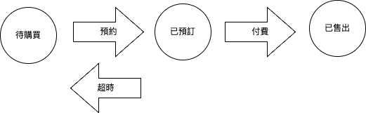

### 有限狀態機

設計訂票系統常常有些連續狀態如「待購買」「已預訂」「已售出」，操作行為包含「預定」「付費」「超時」

狀態透過狀態操作進行變更




### 未使用狀態機時，將違反開放封閉原則


```java
if(state=='待購買'){
  if(action=='預定'){
     state="已預定";
  }
}
if(state=='已預訂'){
  if(action=='付費'){
     state="已售出";
  }
}

```

有限狀態機規則圖如下


context ：狀態上下文

state：狀態行為介面

concreteStateA:某狀態行為操作


```java
class WantBuyState implements IState{

    private Context context;

    public void 預約(){
	///業務規則
        context.setStatus("已預訂");
    }


}
```


[參考GIT](git@github.com:h8000572003/commons-design.git)
